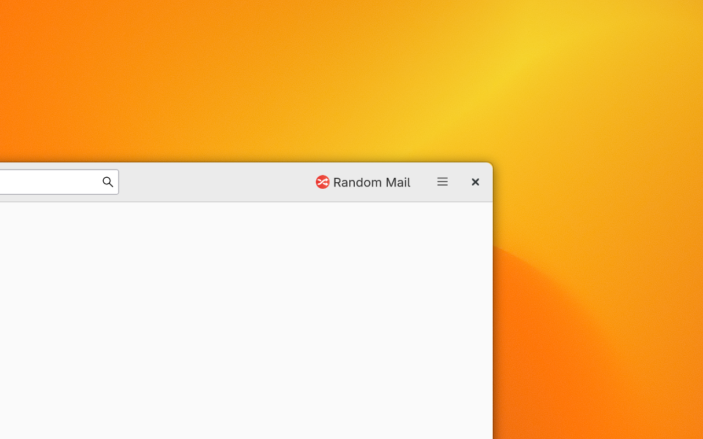

# 🔀 Random Mail

**Thunderbird add-on which adds a toolbar button to open a random mail from any folder!** (Excluding spam and trash.)

Available on [Thunderbird add-ons](https://addons.thunderbird.net/eN-US/thunderbird/addon/random-mail/)!

Very useful to clean up, organize, or just reminisce – with the excitement of randomness.

Part of the [Keep or Sweep](http://keeporsweep.net) ecosystem.
